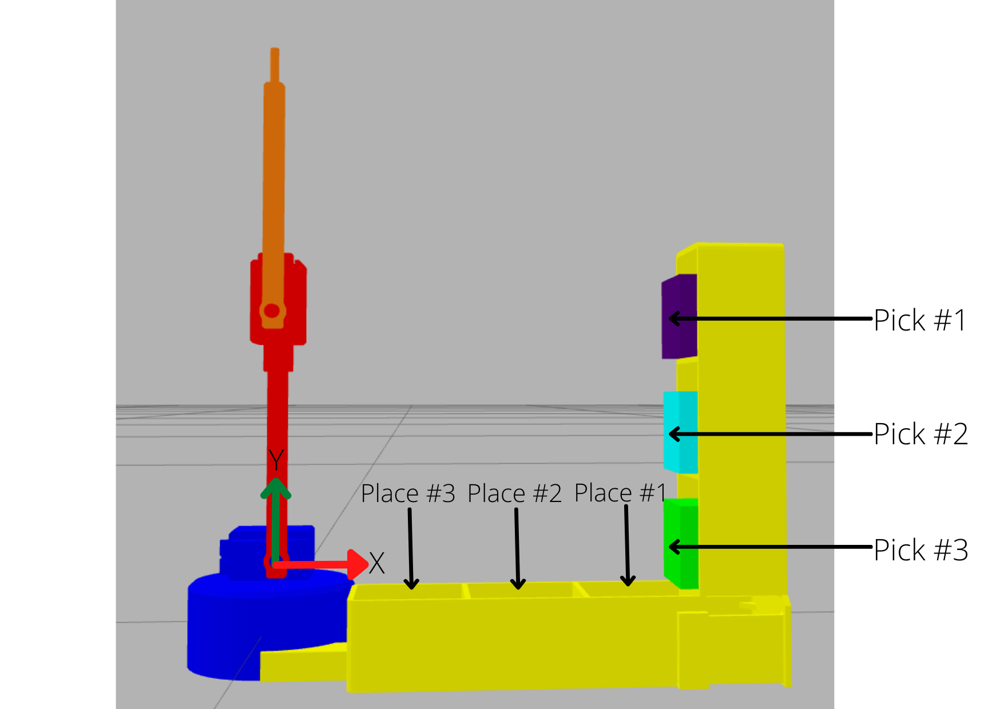

# r2b_arm

## About

A metapackage containing ROS packages that aid in control, simulation, and visualization of the **r2b_arm** developed for robotics training during Step Sessions conducted by the Robotics Club, IIITDM Kancheepuram.

## List of ROS packages

| Package Name | Brief description |
| --- | --- |
| [r2b_control](./r2b_control) | Main package containing nodes, and launch files for execution of control algorithms, and simulations. | 
| [r2b_description](./r2b_description) | Contains resources describing the geometry, actuators, and sensors of the robot. |
| [r2b_env](./r2b_env) | Contains resources describing the Gazebo environment for simulation. |
| [r2b_utility](./r2b_utility) | Contains utility resources like custom message, services, and other add-ons for better intuitive control of the r2b robot. |
| [gazebo_ros_link_attacher](./gazebo_ros_link_attacher) | Utility ROS package added as a submodule to aid in simulating grasp. |

## Setup

To setup the repository onto your local machine:
```bash
# navigate to the src directory of your catkin workspace
git clone --recursive https://github.com/roboticsclub-iiitdm/r2b_arm.git

# install the gazebo development libraries (mandatory)
sudo apt-get install libgazebo11-dev
```
## Additional details to aid in simulation

### On r2b_arm

- Link 1 length: 8.773 cm
- Link 2 length: 9.1 cm

### On coordinates 

The following coordinates are defined w.r.t. fixed frame at joint_1's frame as shown in the figure.

| Location | Coordinates (in cm) |
| --- | --- | 
| Pick 1 | (13.8771, 8.65728) |
| Pick 2 | (13.8771, 4.65728) |
| Pick 3 | (13.8771, 0.65728) |
| Place 1 | (12.6796, -0.8548) |
| Place 2 | (8.6796, -0.8548) |
| Place 3 | (4.6796, -0.8548) |



### On inbuilt functions

The following inbuilt functions are available iff code is written in the `main.cpp` file present in the [./r2b_control/src/simulation_task](./r2b_control/src/simulation_task) directory.

#### Function 1
```c++

/**
 * @brief Add delay for the set milli-seconds
 * 
 * @param millis Milli-second delay
 */
void delay(long millis);

// example use-case
delay(1000); // creates a delay of 1 second

```

#### Function 2

```c++
/**
 * @brief Set r2b robot's joint angles.
 * 
 * @param _jnt_1 Angle in degrees
 * @param _jnt_2 Angle in degrees
 */
void setJointAngles(double _jnt_1, double _jnt_2);

// example use-case
r2b.setJointAngles(40, -60);

```

#### Function 3

```c++
/**
 * @brief Toggles the grasping of the cube. Initially nothing is grasped.
 * 
 */
void toggleGrasp();

// example use-case
r2b.toggleGrasp();
```